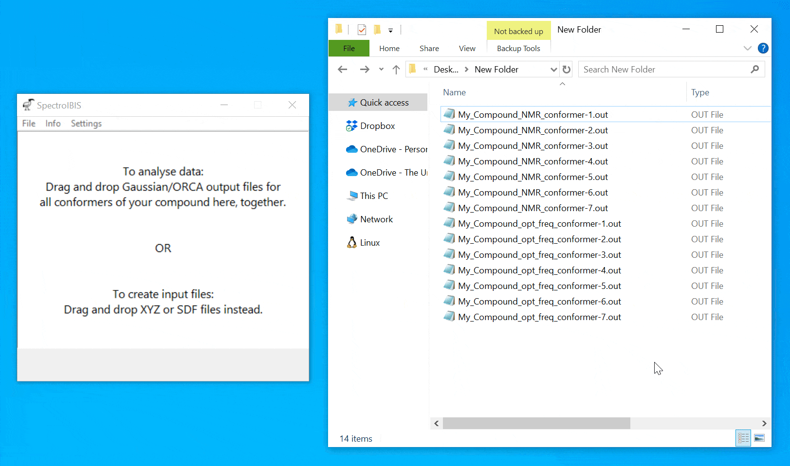
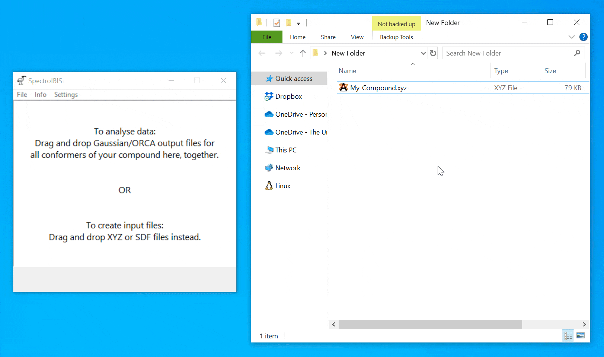
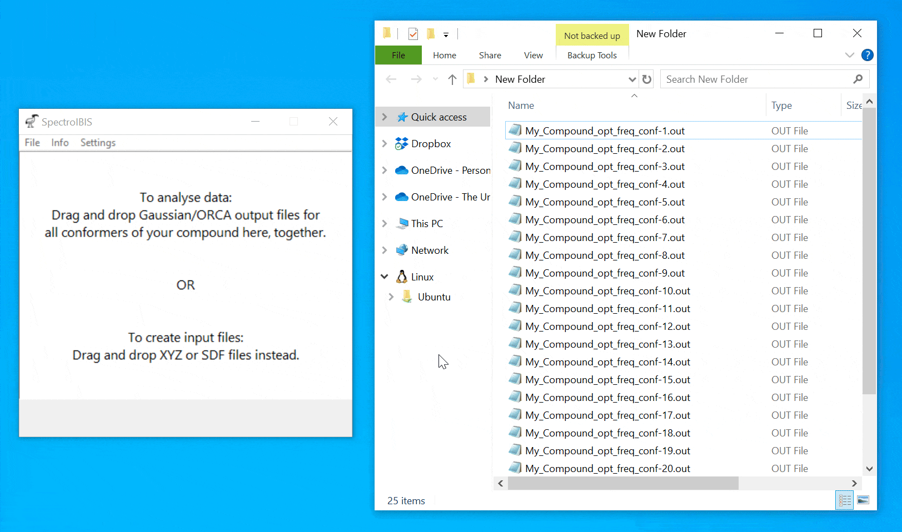

# SpectroIBIS
**SpectroIBIS** is a user-friendly desktop app designed to easily automate tedious tasks in the analysis of multi-conformer quantum chemical spectroscopic calculations, such as predictions of ECD spectra or NMR chemical shifts.

## Key features
+ Extracts data from Gaussian or ORCA output files

+ Checks for redundant conformer geometries and imaginary frequencies

+ Saves Boltzmann-averaged spectroscopic data (ECD, VCD, UV-Vis, IR, optical rotation or NMR) in convenient formats, such as BIL files for visualization in [SpecDis](https://specdis-software.jimdofree.com)

+ Generates publication-quality supplementary data tables with conformer energies, atomic coordinates and spectroscopic properties

+ Can also create input files for Gaussian or ORCA

+ Simple drag-and-drop user interface, no programming experience required

## Download
Click here to download the latest version for Windows: [SpectroIBIS v1.0.0 (ZIP)](https://github.com/bbulcock/SpectroIBIS/releases/download/v1.0.0/SpectroIBIS.zip)

## Usage
**Processing of output files for NMR chemical shift predictions:**

**Creation of input files from XYZ files:**

**Creation of input files from output files, excluding conformers with relative energies above 10 kJ/mol:**

## Need help?
Check out the included [User Manual](https://github.com/bbulcock/SpectroIBIS/releases/download/v1.0.0/SpectroIBIS_Manual.pdf), submit a question in the [Issues](https://github.com/bbulcock/SpectroIBIS/issues) section or send me an [Email](mailto:spectroibis@gmail.com).
